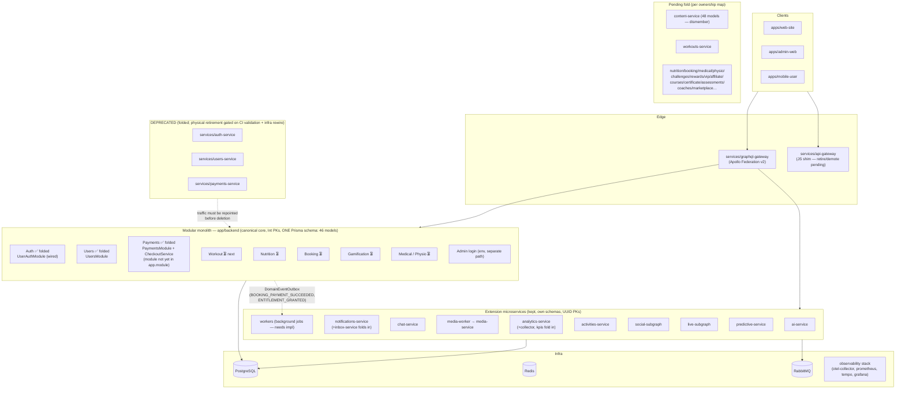

# Architecture — v0.3 baseline (pre-Workout checkpoint)

State as of commit `7373d88` on `claude/project-completion-prompt-0y30ok`.
This is the rollback point before the Workout fold (tag: `v0.3-architecture-baseline`).

## Target topology (approved) vs current state

## Load-bearing shared packages (keep, harden)

| Package | Consumers | Role |
|---|---|---|
| `@arman/observability-sdk` | 39 | otel/register bootstrap |
| `@arman/security-middleware` | 33 | JWT verify, CSP, rate limit |
| `@arman/service-kit` | 10 | Express service bootstrap (has `as any` debt, D7) |
| `@arman/integration` | 10 | db/queue helpers |

## Strangler seams (extraction contract)

Every folded core domain exposes only its module's public service API
(`UserAuthService`, `UsersService`, `CheckoutService`) and communicates
cross-domain via `DomainEventOutbox` where async. No direct cross-module
imports of internals — this is what keeps later extraction to a microservice
non-breaking.

## Deploy-manifest truth table (unchanged since Stage 1 — still D3)

| Manifest | Deploys | Consistent with target? |
|---|---|---|
| `deploy/docker-compose.prod.yml` | monolith (`backend`) + vitrin | Partially — misses kept extension services |
| `docker-compose.yml` (dev) | auth-service, 3 subgraphs, api-gateway, infra | No — deploys a DEPRECATED service |
| `services/graphql-gateway` defaults | 8 subgraphs incl. users/content | No — routes to DEPRECATED/pending services |
| `k8s/` | per-service incl. auth-service | No — includes DEPRECATED services |

Rewiring these is the **\*-RETIRE** follow-up series, gated on CI runtime validation.
