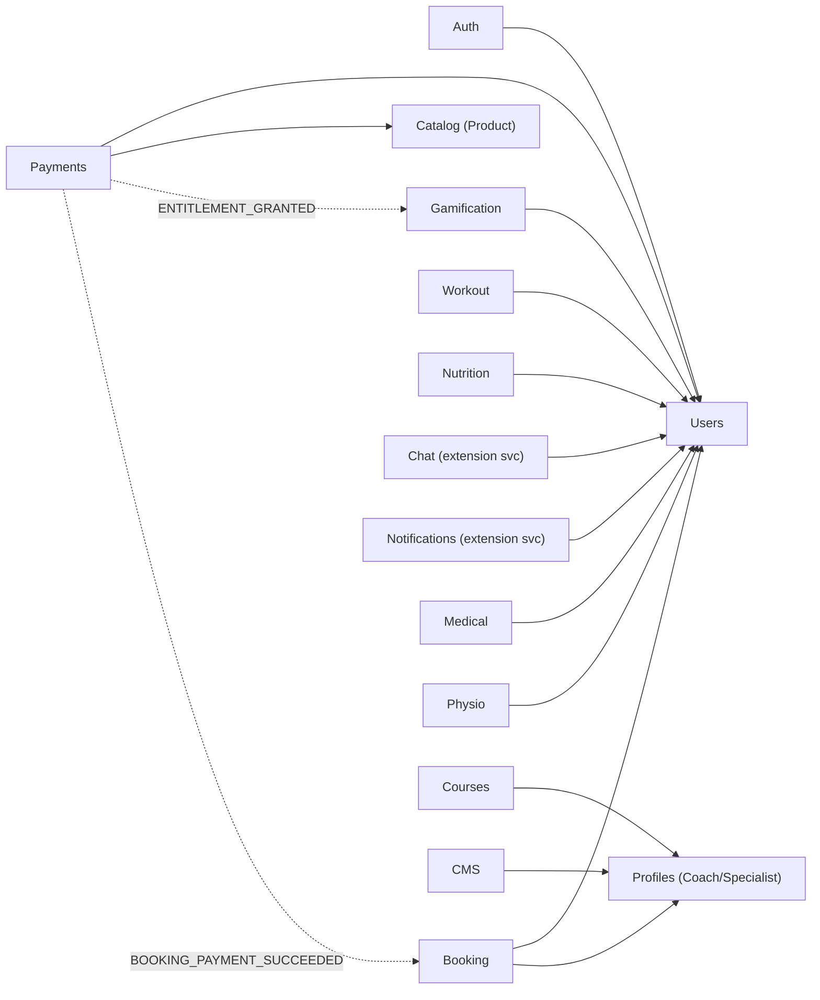

# Domain dependency graph — v0.3 baseline

Two layers: (1) business-domain dependencies inside the canonical model,
derived from actual FK relations and event flows in the canonical schema and
folded services; (2) workspace package graph (refreshed post-Phase-1).

## 1. Business-domain dependencies (canonical core)

Arrows read "depends on / references". Dashed = async via `DomainEventOutbox`
(no synchronous coupling).

Facts behind the edges (from the schema, not aspiration):

- `Session`/`RefreshToken`/`Device`/`PasswordResetToken` FK → `User` (Auth→Users).
- `Payment.userId`, `CheckoutSession.userId`, `Order.userId` → `User`;
  `CheckoutSession.productId`, `Order.productId` → `Product` (Payments→Users/Catalog).
- Outbox events `ENTITLEMENT_GRANTED` and `BOOKING_PAYMENT_SUCCEEDED` are the
  only cross-domain writes Payments makes — by design (ADR-B5).
- `Workout.userId`, `Meal.userId`/`MealLog.userId`, `Reservation.userId`,
  `LeaderboardEntry.userId`, `Notification.userId`, `Message.senderId/receiverId`
  → `User`.
- `Content.specialistId`, `Course.specialistId`, `SpecialistRating.specialistId`
  → `Specialist` (Profiles).

**Users is the root domain** (highest in-degree) — which is why it was folded
immediately after Auth and why its PK type (Int) anchors the core.

## 2. Workspace package graph (refreshed at this baseline)

- **70 workspace projects** (was 74 pre-Phase-1; 4 dead components removed).
- **104 internal edges.**
- **14 orphan libs** remain in `packages/*` with 0 internal consumers
  (was 17; 3 empty ones deleted in Phase 1):
  `@arman/auth`, `@arman/auth-kit`, `@arman/user-live`, `@arman/contracts`,
  `@arman/contracts-tests`, `@arman/env-config`, `@arman/graphql-dataloader`*,
  `@arman/graphql-utils`*, `@arman/infra`, `@arman/integrations`,
  `@arman/nest-bootstrap`, `@arman/observability`*, `@arman/resilience`,
  `@arman/shared`.

  \* imported via tsconfig path aliases by `app/backend` source without a
  package.json dependency entry — *used but undeclared*. Verified wider: the
  backend declares **none** of the 8 `@arman/*` packages it imports (tracked as
  D11 in the debt delta). Deleting these three would break the backend;
  declaring the deps is the fix.

- Top consumers unchanged: observability-sdk (39), security-middleware (33),
  service-kit (10), integration (10).
