# Canonical Prisma ERD — v0.3 baseline

Source: `app/backend/src/database/prisma/schema.prisma` — **46 models** (generated mechanically from the schema; do not hand-edit).

```mermaid
erDiagram
    Payment }o--o| User : "user"
    AnalyticsEntity }o--o| User : "user"
    AiEntity }o--o| User : "user"
    Meal }o--|| User : "user"
    Wallet }o--|| User : "user"
    Workout }o--o| User : "user"
    Message }o--|| User : "sender"
    Message }o--|| User : "receiver"
    Message }o--o| Attachment : "attachment"
    Message }o--o| Conversation : "conversation"
    LeaderboardEntry }o--|| User : "user"
    Notification }o--|| User : "user"
    MealLog }o--|| Food : "food"
    MealLog }o--|| User : "user"
    Specialist }o--|| User : "user"
    SpecialistRating }o--|| User : "user"
    SpecialistRating }o--|| Specialist : "specialist"
    Content }o--|| Specialist : "specialist"
    Course }o--|| Specialist : "specialist"
    Session }o--|| User : "user"
    RefreshToken }o--|| User : "user"
    Device }o--|| User : "user"
    PasswordResetToken }o--|| User : "user"
    CheckoutSession }o--|| Product : "product"
    Order }o--|| Product : "product"
    User {
        Int id PK
        String email UK
        String name
        String password
        String passwordHash
        String role
    }
    Admin {
        Int id PK
        String email UK
        String name
        DateTime createdAt
    }
    Payment {
        Int id PK
        String authority UK
        DateTime createdAt
        Int amount
        String status
        Int userId
    }
    AnalyticsEntity {
        Int id PK
        Int userId
        String kpi
        Int value
        DateTime recordedAt
    }
    AiEntity {
        Int id PK
        DateTime createdAt
        Int userId
        String plan
    }
    Challenge {
        Int id PK
        String name
        String description
        Int duration
        DateTime createdAt
    }
    Cms {
        Int id PK
        DateTime createdAt
        String title
        String body
        String category
    }
    Coach {
        Int id PK
        String email UK
        String name
        String expertise
        DateTime createdAt
    }
    Corporate {
        Int id PK
        DateTime createdAt
        String companyName
        String industry
    }
    Live {
        Int id PK
        String title
        String description
        DateTime startedAt
    }
    Marketplace {
        Int id PK
        String name
        String description
        Int price
        DateTime createdAt
    }
    Meal {
        Int id PK
        String name
        Int userId
        DateTime date
        Int kcal
    }
    Payroll {
        Int id PK
        String coachName
        Int amount
        String period
        DateTime createdAt
    }
    Support {
        Int id PK
        String userEmail
        String subject
        String message
        String status
    }
    Survey {
        Int id PK
        String title
        String question
        DateTime createdAt
    }
    Wallet {
        Int id PK
        Int userId UK
        Int balance
        DateTime createdAt
    }
    Workout {
        Int id PK
        String title
        Json data
        Int userId
        DateTime createdAt
    }
    Message {
        Int id PK
        Int senderId
        Int receiverId
        String content
        Int attachmentId
    }
    LeaderboardEntry {
        Int id PK
        Int userId
        Int xp
        Int calories
        Int sessions
    }
    AuditLog {
        Int id PK
        String event
        Json payload
        DateTime createdAt
    }
    IdempotencyKey {
        String key PK
        String requestHash
        DateTime createdAt
        DateTime lastSeenAt
    }
    Reservation {
        Int id PK
        Int userId
        Int resourceId
        DateTime startsAt
        DateTime endsAt
    }
    Notification {
        Int id PK
        Int userId
        String text
        Boolean read
        DateTime createdAt
    }
    AvailabilitySlot {
        Int id PK
        Int coachId
        DateTime startsAt
        DateTime endsAt
        String rrule
    }
    Attachment {
        Int id PK
        String thumbKey
        String key
        String contentType
        Int width
    }
    Food {
        Int id PK
        String barcode UK
        String title
        Float protein
        Float carbs
        Float fat
    }
    MealLog {
        Int id PK
        Int userId
        Int foodId
        Int grams
        DateTime createdAt
    }
    Vod {
        String id PK
        String room
        String url
        String filepath
        DateTime startedAt
    }
    Specialist {
        Int id PK
        Int userId UK
        String bio
        String videoUrl
        Float rating
        DateTime createdAt
    }
    SpecialistRating {
        Int id PK
        Int userId
        Int specialistId
        Int score
        String comment
    }
    Conversation {
        Int id PK
        DateTime createdAt
    }
    Content {
        Int id PK
        Int specialistId
        String title
        String description
        String videoUrl
    }
    Course {
        Int id PK
        Int specialistId
        String title
        String description
        Int price
    }
    Experiment {
        Int id PK
        String name
        String hypothesis
        DateTime createdAt
    }
    Refund {
        Int id PK
        Int paymentId
        Int amountCents
        String providerRefundId
        DateTime createdAt
    }
    WebhookEvent {
        Int id PK
        String eventId UK
        String provider
        Json payload
        DateTime processedAt
        Boolean success
    }
    Subscription {
        Int id PK
        String userId
        String provider
        String externalId
        String status
    }
    Session {
        Int id PK
        Int userId
        String userAgent
        String ip
        DateTime createdAt
    }
    RefreshToken {
        Int id PK
        String selector UK
        Int userId
        String verifierHash
        DateTime createdAt
        DateTime expiresAt
    }
    Device {
        Int id PK
        Int userId
        String name
        String userAgent
        String ip
    }
    PasswordResetToken {
        Int id PK
        String tokenHash UK
        Int userId
        DateTime expiresAt
        DateTime usedAt
    }
    Product {
        Int id PK
        String code UK
        String kind
        String name
        Int amountCents
        String currency
    }
    CheckoutSession {
        Int id PK
        String providerSessionId UK
        Int userId
        Int productId
        Int amountCents
        String currency
    }
    PaymentEvent {
        Int id PK
        String eventId UK
        String provider
        String type
        Int sessionId
        Json payload
    }
    Order {
        Int id PK
        Int userId
        Int productId
        Int amountCents
        String currency
    }
    DomainEventOutbox {
        Int id PK
        String type
        Json data
        DateTime processedAt
        DateTime createdAt
    }
```

## Non-canonical schemas still present (extension/pending domains)

| Schema | Models | Status per ownership map |
|---|---|---|
| `app/activity-subgraph/prisma/schema.prisma` | 5 | partial fold (Workout dup) / Activity keep |
| `app/social-subgraph/prisma/schema.prisma` | 4 | KEEP — extension (Social) |
| `services/activities-service/prisma/schema.prisma` | 4 | KEEP — extension microservice (Activity) |
| `services/ai-service/prisma/schema.prisma` | 5 | KEEP — extension microservice (AI) |
| `services/analytics-collector/prisma/schema.prisma` | 2 | fold into analytics-service |
| `services/assessments-service/prisma/schema.prisma` | 4 | pending fold (Assessments) |
| `services/auth-service/prisma/schema.prisma` | 5 | DEPRECATED — folded (Phase 3) |
| `services/booking-service/prisma/schema.prisma` | 3 | pending fold (Booking) |
| `services/certificate-service/prisma/schema.prisma` | 1 | pending fold (Courses) |
| `services/challenges-service/prisma/schema.prisma` | 2 | pending fold (Gamification) |
| `services/chat-service/prisma/schema.prisma` | 6 | KEEP — extension microservice (Chat) |
| `services/coaches-service/prisma/schema.prisma` | 1 | pending fold (Profiles) |
| `services/content-service/prisma/schema.prisma` | 48 | pending dismemberment (multi-domain) |
| `services/courses-service/prisma/schema.prisma` | 3 | pending fold (Courses) |
| `services/inbox-service/prisma/schema.prisma` | 1 | fold into notifications-service |
| `services/medical-service/prisma/schema.prisma` | 8 | pending fold (Medical) |
| `services/notifications-service/prisma/schema.prisma` | 2 | KEEP — extension microservice (Notifications) |
| `services/nutrition-service/prisma/schema.prisma` | 6 | pending fold (Nutrition) |
| `services/payments-service/prisma/schema.prisma` | 6 | DEPRECATED — folded (Phase 4) |
| `services/physio-service/prisma/schema.prisma` | 6 | pending fold (Physio) |
| `services/rewards-service/prisma/schema.prisma` | 8 | pending fold (Gamification) |
| `services/users-service/prisma/schema.prisma` | 1 | DEPRECATED — folded (Phase 4) |
| `services/workouts-service/prisma/schema.prisma` | 3 | pending fold (Workout, next) |
