# Architecture Overview

Generated: 2025-08-08T17:30:43.975075Z

## Services
- affiliate-service
- ai-service
- assessment-service
- auth-service
- challenges-service
- chat-service
- coaches-service
- content-service
- courses-service
- marketplace-service
- monitoring-service
- notifications-service
- nutrition-service
- payments-service
- predictive-service
- reward-service
- users-service
- vip-service
- workouts-service

## Mermaid Graph (simplified)

```mermaid
graph LR
  0["affiliate-service"]
  1["ai-service"]
  2["assessment-service"]
  3["auth-service"]
  4["challenges-service"]
  5["chat-service"]
  6["coaches-service"]
  7["content-service"]
  8["courses-service"]
  9["marketplace-service"]
  10["monitoring-service"]
  11["notifications-service"]
  12["nutrition-service"]
  13["payments-service"]
  14["predictive-service"]
  15["reward-service"]
  16["users-service"]
  17["vip-service"]
  18["workouts-service"]
  0 --> 1
  1 --> 2
  2 --> 3
  3 --> 4
  4 --> 5
  5 --> 6
  6 --> 7
  7 --> 8
  8 --> 9
  9 --> 10
  10 --> 11
  11 --> 12
  12 --> 13
  13 --> 14
  14 --> 15
  15 --> 16
  16 --> 17
  17 --> 18
  18 --> 0
```

